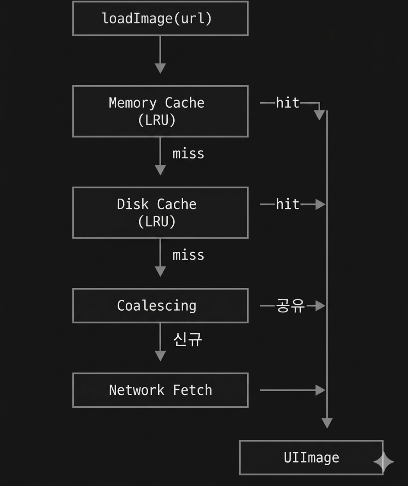

# ImagePipeline

이미지 로드의 단일 진입점. 메모리 → 디스크 → 네트워크 fallback과 중복 요청 합치기.

## API

```swift
public nonisolated func loadImage(_ request: ImageRequest) async throws -> UIImage

nonisolated public static var shared: ImagePipeline { get set }
```

```swift
public struct ImageRequest: Sendable, Hashable {
    public init(url: URL, options: ImageRequestOptions? = nil)
}

public struct ImageRequestOptions: Sendable, Hashable {
    public init(pointSize: CGSize, scale: CGFloat)   // 다운샘플
}
```

## 동작

### 로드 순서

<p align="center">
  
</p>

1. 메모리 캐시 (디코딩된 `UIImage`)
2. 디스크 캐시 (다운샘플 결과를 먼저 보고, 없으면 원본 데이터)
3. 진행 중인 같은 요청에 합류 (중복 합치기)
4. 네트워크 다운로드

### 중복 요청 합치기 (dedup)
같은 `(url, options)` 조합으로 동시에 들어온 요청은 한 번만 네트워크에 나가고 결과를 공유합니다.

한 호출자가 취소되면 그 호출자만 `CancellationError` 로 깨어나고 다른 호출자의 작업은 계속됩니다. 마지막 호출자까지 취소되면 공유 작업도 함께 취소되어 진행 중인 이미지 네트워크 요청까지 중단됩니다 (네트워크 자원 즉시 회수).

### 다운샘플 결과 캐싱
다운샘플 옵션이 있을 때 결과 이미지를 별도 디스크 키로 저장합니다. 같은 URL을 다른 사이즈로 다시 요청해도 디코딩이 한 번이면 됩니다.

### 메모리 워닝 처리
시스템 메모리 워닝 수신 시 메모리 캐시만 비웁니다. 디스크 캐시는 유지됩니다.

## Configuration

```swift
public struct Configuration: Sendable {
    public var memoryCache: MemoryCache?       // 기본 MemoryCache(), nil이면 비활성
    public var diskCache: DiskCache?           // 기본 nil
    public var fetcher: any ImageDataFetcher
    public var decoder: any ImageDecoder
    public var encoder: any ImageEncoder
}
```

## 캐시 모드 (ConfigurationFactory)

영속 캐시 전략은 두 가지 중 하나를 고를 수 있습니다.

### 자체 DiskCache 사용 (권장)
라이브러리가 직접 관리하는 LRU 디스크 캐시를 사용합니다. `URLCache`는 끕니다.

```swift
// 가장 짧은 형태. 기본 200MB DiskCache가 자동 생성됨
ImagePipeline(configuration: .defaultDiskCache)

// DiskCache를 직접 만들어 용량·디렉토리 등을 커스터마이징
ImagePipeline(configuration: .diskCache(
    try DiskCache(sizeLimit: 500 * 1024 * 1024),
    memoryCache: MemoryCache(costLimit: 100 * 1024 * 1024)
))
```

`.defaultDiskCache`는 `DiskCache` 생성에 실패하면 `fatalError`를 냅니다. 앱 시작 시점에서만 호출하세요.

### URLCache 위임 (HTTP 캐시 사용)
`URLCache`로 HTTP 표준 캐시 헤더(`ETag`, `Cache-Control`, `Last-Modified`)에 따라 캐싱합니다. 자체 디스크 캐시는 사용하지 않습니다.

```swift
ImagePipeline(configuration: .httpCache(diskCapacityMB: 100))
```

서버가 적절한 캐시 헤더를 내려줄 때 적합합니다.

## See Also

- [ImageRequest](ImageRequest.md) · [Prefetcher](Prefetcher.md)
- [MemoryCache](../Caches/MemoryCache.md) · [DiskCache](../Caches/DiskCache.md)
- [Networks](../Networks/Networks.md)
