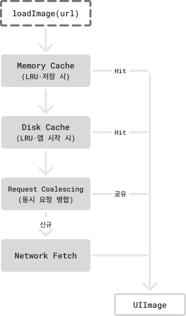

<p align="center">
  
</p>

# KCache

Kim**K**yu**C**hul · iOS Cache Library

iOS 앱에서 이미지를 다운로드하고 캐싱하기 위한 라이브러리입니다. Swift 6 동시성 위에서 동작하며, 메모리·디스크 2계층 캐시와 중복 요청 합치기, 뷰 해제 시 자동 취소 같은 기본기를 표준으로 제공합니다. (SwiftUI와 UIKit 통합을 모두 포함합니다.)

> **Memory & Disk Cache** · **Request Coalescing** · **Auto Cancellation** · **Prefetching** · **Downsampling** · **SwiftUI** · **UIKit** · **Swift 6 Concurrency**

## Usage

`ImagePipeline`로 이미지를 로드합니다.

```swift
let pipeline = ImagePipeline(configuration: .default)
let image = try await pipeline.loadImage(for: ImageRequest(url: url))
```

또는 SwiftUI [`KCImage`](Documentation/UI/SwiftUI.md), UIKit [`UIImageView+KCImage`](Documentation/UI/UIKit.md)로도 동일한 파이프라인을 사용할 수 있습니다.

```swift
KCImage(request: ImageRequest(url: url)) { state in
    switch state {
    case .loading:           ProgressView()
    case .success(let img):  img.resizable().scaledToFit()
    case .failure:           Image(systemName: "photo")
    }
}
```

리스트/그리드 스크롤 시 미리 캐시에 적재하려면 [`KCImagePrefetcher`](Documentation/ImagePipeline/Prefetcher.md)를 사용합니다.

```swift
let prefetcher = KCImagePrefetcher()
prefetcher.prefetchImage(requests)
```

## Architecture

<p align="center">
  
</p>

`loadImage()` 호출은 메모리 → 디스크 → 네트워크 순으로 내려가며, 어느 단계든 hit이 나면 즉시 `UIImage`를 돌려줍니다. 리스트가 빠르게 스크롤되며 같은 URL이 여러 번 동시에 들어와도 네트워크에는 한 번만 나가고, 진행 중인 작업에 합류해 결과를 나눠 받습니다.

내부 동작과 설정 옵션은 [`ImagePipeline`](Documentation/ImagePipeline/ImagePipeline.md) 문서를 참고하세요.

## Documentation

| 모듈 | 설명 |
| --- | --- |
| [**ImagePipeline**](Documentation/ImagePipeline/ImagePipeline.md) | 이미지 로드 진입점 |
| [**ImageRequest**](Documentation/ImagePipeline/ImageRequest.md) | 이미지 요청 정의 (URL, 다운샘플) |
| [**Prefetcher**](Documentation/ImagePipeline/Prefetcher.md) | 이미지 미리 적재 |
| [**MemoryCache**](Documentation/Caches/MemoryCache.md) | 메모리 캐시 (LRU) |
| [**DiskCache**](Documentation/Caches/DiskCache.md) | 디스크 캐시 (LRU) |
| [**Networks**](Documentation/Networks/Networks.md) | 이미지 다운로드 |
| [**SwiftUI**](Documentation/UI/SwiftUI.md) | `KCImage` 컴포넌트 |
| [**UIKit**](Documentation/UI/UIKit.md) | `UIImageView` 확장 |

전체 개요는 [`Documentation/KCache.md`](Documentation/KCache.md)를 참고하세요.

## Requirements

- iOS 16.0+
- Swift 6.0+ (Xcode 16+)

## Installation

Swift Package Manager:

```swift
.package(url: "https://github.com/kimkyuchul/KCImageCache.git", from: "1.0.0")
```

패키지에서 두 product를 제공합니다.

| Product | 용도 |
| --- | --- |
| **KCImageCache** | 이미지 로드 코어 (`ImagePipeline`, `ImageRequest`, 캐시) |
| **KCImageCacheUI** | SwiftUI `KCImage`, UIKit `UIImageView+KCImage` |

## License

MIT 라이선스를 따릅니다. [LICENSE](LICENSE) 파일을 참고하세요.

## Acknowledgments

이 라이브러리의 설계는 [Nuke](https://github.com/kean/Nuke)와 [Kingfisher](https://github.com/onevcat/Kingfisher)의 구조에서 많은 영향을 받았습니다.
